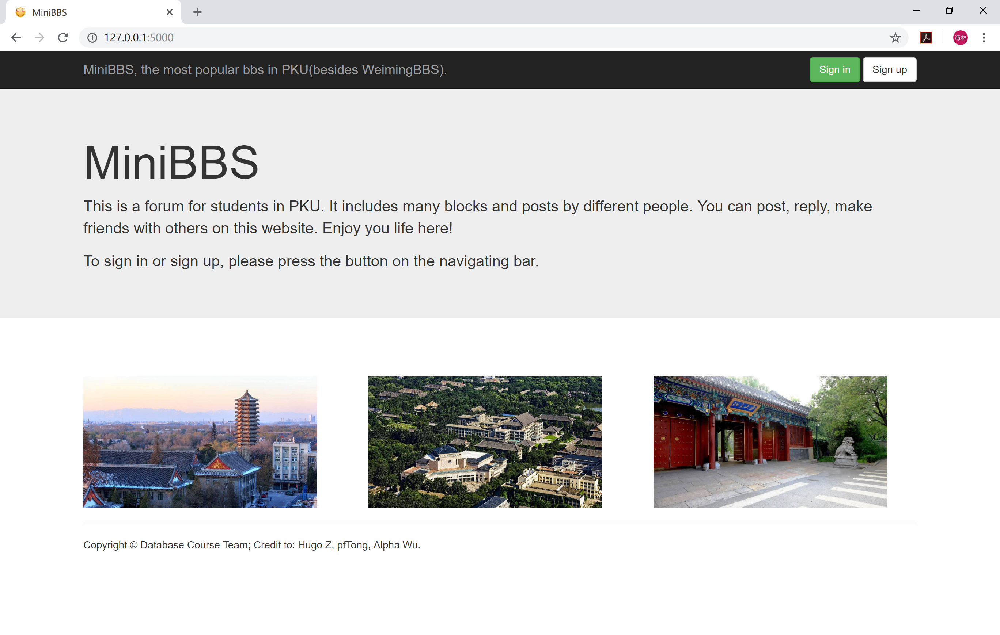
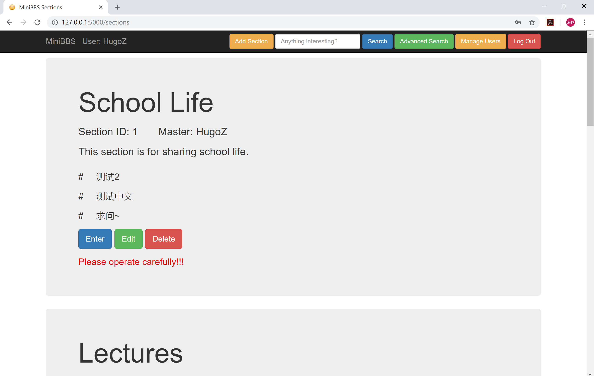
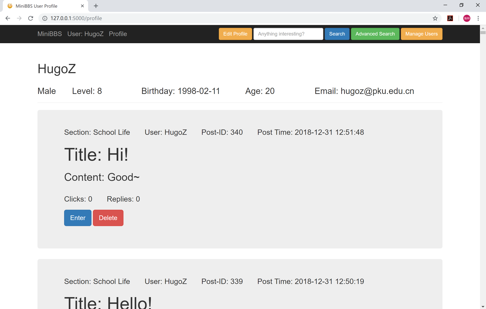
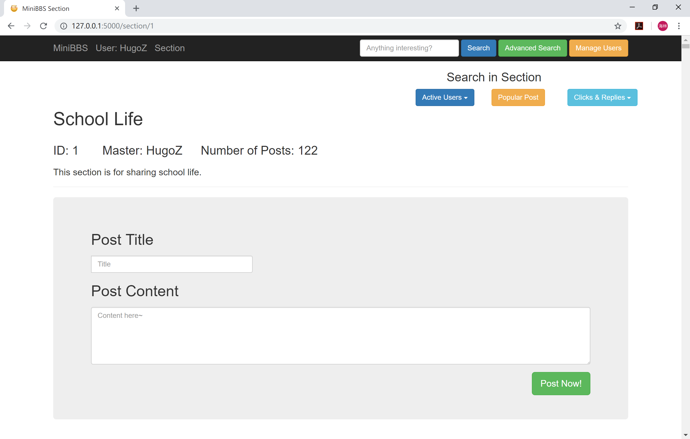
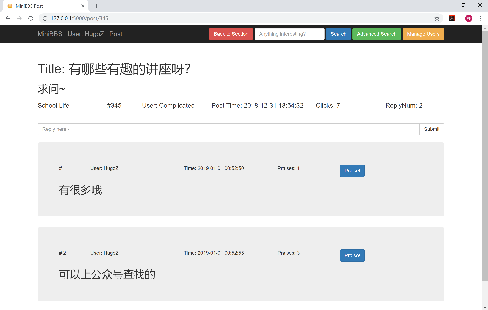
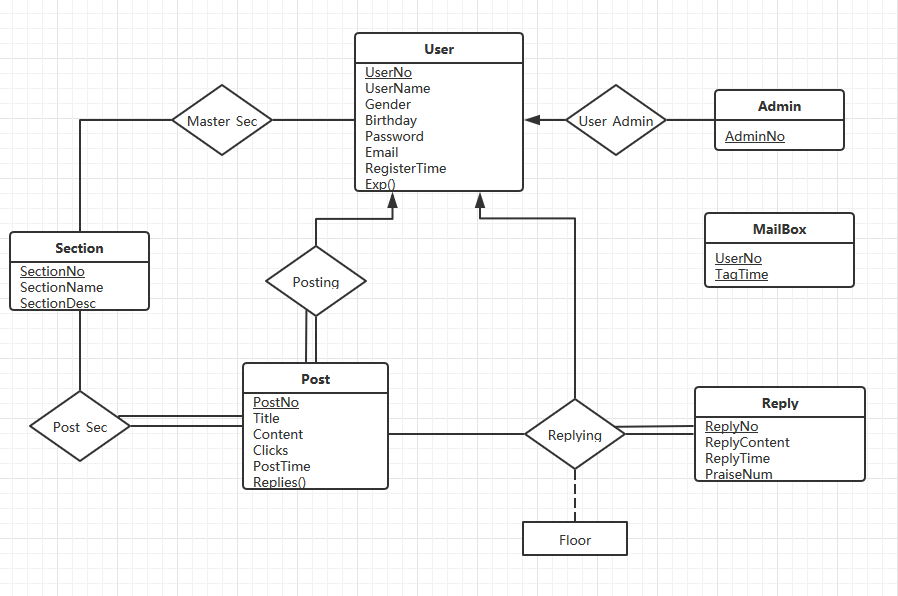

# MiniBBS 项目说明

###1.简介

MiniBBS是一款小型的BBS（论坛）软件，虽然简单但是界面美观功能齐全。

* **开发分工** ： 
  * 张海林：设计整体框架，负责整个前端、XML创建读取、部分后端数据库逻辑。
  * 童培峰：设计数据库结构，负责部分后端数据库逻辑。
  * 伍诗彬：设计数据，负责部分后端数据库逻辑。
* **开发技术** ：
  * 前端：Bootstrap（渲染）+Ajax（读取XML）+Flask（连接）
  * 后端：Python
  * 数据库：MySQL
  * 部署：Apache
* **工程总量** ：HTML页面较多，总体代码量很大，但大部分结构可以复用；Flask逻辑500行内；数据库操作1000行左右。HTML和数据库操作中较为麻烦的点在于XML文件生成和读取，需要大量代码处理XML中的树。由于是第一次接触全栈工作，因此用时较长（半个月），代码结构也并不完美，有复用删改的余地；若有经验应该可以更快完成（5-10天）。

### 2.程序使用

* 需要的Python包：flask，xml，pymysql(以及cryptography)，smtplib，email
* 按照MiniBBS_Building.txt中的语句进行数据库搭建
* （可选）运行database.py生成测试数据（python database.py）
* 运行minibbs.py开始服务，可以在本机进行访问（python minibbs.py）
* （可选）配置Apache进行部署

### 3.界面

由于开发者第一次接触HTML/CSS/JS，因此复用、模仿了很多Bootstrap模板，风格较为单一。部分页面如下：

* 首页（未登录）：
* 主页（登录后，使用的是管理员账号，普通账号界面有所不同）：
* 个人主页：
* 版块主页：
* MiniBBS十大（前十点击量&前十回复数）：
* 帖子：

以上是部分界面的概览。还有很多其他界面欢迎亲自发掘。

### 4.功能

MiniBBS包含了很多功能，除了传统的BBS功能，它还有着强大的搜索能力。支持的功能如下：

* 登录、注册成为普通用户、登出
* 账户类型的不同会导致界面不一样（根据是否有编辑权限出现的按钮不同）
* 支持查看个人主页和全体成员基本信息以及他们的个人主页（包括个人信息和动态）
* 管理员在全体成员信息页有添加、删除用户权限
* 查看版块列表（即论坛主页）
* 管理员在论坛主页有添加、编辑、删除版块的权限，版务有对自己版块的编辑权限
* 支持普通搜索功能，可以查询帖子标题 、内容中的关键字
* 支持论坛高级搜索功能，可以查看点击前十和回复前十的帖子
* 论坛高级搜索功能页的还可以查看在版块A发帖比在版块B发帖数量多的用户
* 支持版块主页，可以在版块主页发帖
* 支持帖子页，可以在帖子页进行回复
* 帖子可以被有权限的人删除（本人、版务、管理员），回复不可被删除，否则容易造成Floor混乱
* 版块内高级搜索功能一：查找在本版块发过帖或回复过的用户（可按发帖数或回复数排序）
* 版块内高级搜索功能二：热度最高的帖子（最后回复时间-发帖时间）以及其回复（包括ReplyUser等信息）
* 版块内高级搜索功能三：查找点击数高于版块平均的帖子、回复数高于版块平均的用户
* 流量检查：对于十分钟内发帖数高于十的用户将发邮件给管理员进行提醒
* 出于安全性考量，我们对cookies设置了严格的时间限制（一小时），返回未登录的首页将自动清楚所有cookies；同时，权限的控制经过了严格的测试，不同权限者的不同界面保证了论坛正常运行；在后端，所有需要open的文件、数据库、连接都有相应的close，所有为了临时需要创建的view都有相应的drop，保证不会出现占用存储、数据泄露。
* 特别注意，个人主页、版块主页、帖子页这三个页面由XML实现，具体细节为：从数据库请求信息生成服务器端的XML文件，然后在HTML页面使用Ajax技术将XML文件读取并显示。

### 5.数据库

* ER图

* 关系模式（在效率和存储之间做了权衡，具体设计的View和Index请查看MiniBBS_Building.txt）：

  * User

    | 属性           | 数据类型                  | 约束                                 |
    | ------------ | --------------------- | ---------------------------------- |
    | **UserNo**   | INT                   | AUTO_INCREMENT                     |
    | UserName     | VARCHAR(32)           | UNIQUE                             |
    | Gender       | enum('Male','Female') | mysql无法check检查，直接限制合法字符            |
    | Birthday     | DATE                  |                                    |
    | Password     | VARCHAR(45)           |                                    |
    | Email        | VARCHAR(45)           |                                    |
    | EXP          | INT                   | DEFAULT 0 触发器计算得到                  |
    | Admin        | BOOLEAN               | DEFAULT FALSE                      |
    | RegisterTime | TIMESTAMP             | DEFAULT CURRENT_TIMESTAMP 自动记录写入时间 |

  * Section

    | 属性            | 数据类型        | 约束                                     |
    | ------------- | ----------- | -------------------------------------- |
    | **SectionNo** | SMALLINT    | AUTO_INCREMENT                         |
    | SectionName   | VARCHAR(32) | UNIQUE                                 |
    | SectionDesc   | TEXT        |                                        |
    | Master        | INT         | REFERENCES `minibbs`.`User` (`UserNo`) |

  * Post

    | 属性         | 数据类型        | 约束                                       |
    | ---------- | ----------- | ---------------------------------------- |
    | **PostNo** | INT         | AUTO_INCREMENT                           |
    | UserNo     | INT         | REFERENCES `minibbs`.`User` (`UserNo`)   |
    | SectionNo  | SMALLINT    | REFERENCES `minibbs`.`Section` (`SectionNo`) |
    | Title      | VARCHAR(45) |                                          |
    | Content    | LONGTEXT    |                                          |
    | Clicks     | INT         | DEFAULT 0                                |
    | PostTime   | TIMESTAMP   | DEFAULT CURRENT_TIMESTAMP                |
    | Replies    | INT         | DEFAULT 0                                |

  * Reply

    | 属性           | 数据类型      | 约束                                     |
    | ------------ | --------- | -------------------------------------- |
    | **ReplyNo**  | INT       | AUTO_INCREMENT                         |
    | Floor        | INT       |                                        |
    | PostNo       | INT       | REFERENCES `minibbs`.`Post` (`PostNo`) |
    | UserNo       | INT       | REFERENCES `minibbs`.`User` (`UserNo`) |
    | ReplyContent | LONGTEXT  |                                        |
    | ReplyTime    | TIMESTAMP | DEFAULT CURRENT_TIMESTAMP              |
    | PraiseNum    | INT       | DEFAULT 0                              |

  * Mailbox

    | 属性          | 数据类型      | 约束                        |
    | ----------- | --------- | ------------------------- |
    | **UserNo**  | INT       | 触发器计算得到                   |
    | **TagTime** | TIMESTAMP | DEFAULT CURRENT_TIMESTAMP |

需要注意的是，以上所有值都要求了NOT NULL。

### 6.总结

本项目作为北京大学数据库概论课程的实习作业，加深了我们对数据库的理解。项目的要求乍看起来比较繁杂，但都有的放矢，恰到好处，让我们得以有机会接触数据库操作、全栈工作、Ajax技术和部署方法的方方面面。完成这个项目让我们得到了巨大的收获。

感谢老师和助教们的悉心教导！